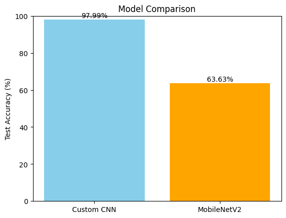

# Traffic Sign Recognition Using Deep Learning


## Overview

This project implements a traffic sign recognition system using Convolutional Neural Networks (CNNs) on the **GTSRB (German Traffic Sign Recognition Benchmark)** dataset. The goal is to classify traffic sign images into 43 distinct categories, aiding autonomous driving systems and driver assistance technologies.

---

## Features

- Dataset: GTSRB from Kaggle  
- Preprocessing: Image resizing, normalization, and ROI cropping  
- Model: Custom CNN and comparison with pre-trained MobileNetV2  
- Data augmentation to improve generalization  
- Evaluation: Accuracy metrics and confusion matrix visualization  
- Model saving and loading with Keras  

---

## Use Cases

- Enhancing autonomous vehicle perception systems  
- Advanced driver assistance systems (ADAS)  
- Real-time traffic sign detection applications  
- Research and development in computer vision and machine learning  

---

## Implementation Details

The pipeline includes:

1. **Data Loading & Preprocessing**  
   Loading CSV-based annotations, cropping images to regions of interest (ROI), resizing to 64x64 pixels, and normalizing pixel values.

2. **Data Augmentation**  
   Using `ImageDataGenerator` to introduce variations like rotations, shifts, zooms, and shear transforms to enhance robustness.

3. **Model Architectures**  
   - **Custom CNN:** A sequential model with convolutional, batch normalization, pooling, dropout, and dense layers.  
   - **MobileNetV2 Transfer Learning:** Pre-trained MobileNetV2 with frozen base layers and a custom classifier head.

4. **Training & Validation**  
   Early stopping and checkpointing to avoid overfitting.

5. **Evaluation**  
   Test set accuracy and confusion matrix plotted to understand per-class performance.

---

## Deployment

- Models are saved in `.keras` format and can be loaded for inference in real-time applications.
- Can be integrated into embedded systems or cloud APIs for traffic sign classification.
- TensorFlow/Keras provides support for deployment on mobile (TensorFlow Lite) or web (TensorFlow.js) platforms.

---

## Requirements

- Python 3.7+  
- TensorFlow 2.x  
- OpenCV  
- Pandas  
- NumPy  
- Matplotlib  
- scikit-learn  

Install with:

```bash
pip install tensorflow opencv-python pandas numpy matplotlib scikit-learn
```

---

## Results Comparison



---